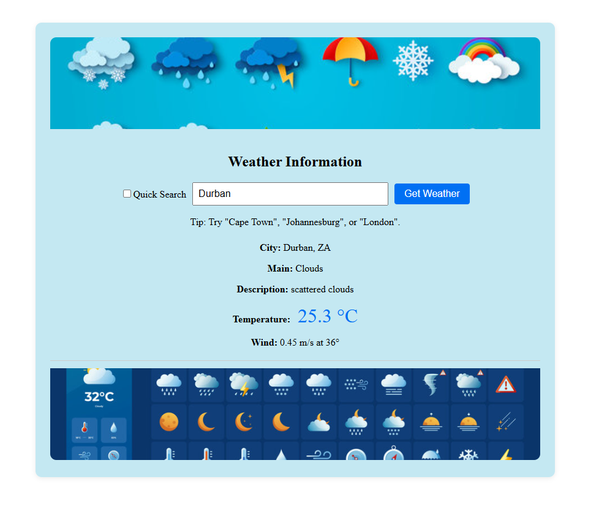

# Weather-App-assessment (Next.js App Router)
Weather-App-assessment

A small weather application built with **Next.js (App Router)** .  
It fetches current weather from **OpenWeatherMap** and demonstrates safe API key handling via a Next.js API Route.

## Features

- City input with validation
- Displays city, country, temperature, condition, description, and an icon
- **Loading** indicator while fetching
- **Robust error handling** (invalid city, network/API errors, rate limits)
- API key secured via Next.js API route
  > **Note:** The default unit is **Celsius** (metric).

## Tech

- Framework: **Next.js 14** (App Router, TypeScript)
- Styling: Minimal CSS (globals + lightweight utility classes)
- State: React `useState`
- API: **OpenWeatherMap Current Weather Data API**
- Security: API Key is **not** exposed to the client; requests are proxied through a Next.js **API Route**

---

## Getting Started (Local)

1. Clone the repository:
  ```bash
   https://github.com/Zizwemkz/Weather-App-assessment
   ```

> Requirements: **Node.js 18+** and **npm** (or **pnpm**/**yarn**)

1. **Clone or download** this repository into a folder, then open it in your terminal.
2. Install dependencies:
   ```bash
   npm install
   ```
3. Create a `.env.local` by copying `.env.example` and fill in your key:
   ```bash
   cp .env.example .env.local
   # then edit .env.local and set your actual OPENWEATHER_API_KEY
   ```
4. Start the dev server:
   ```bash
   npm run dev
   ```
5. Visit **http://localhost:3000** and search for a city.

### Where to get an API Key
Sign up for a free key at https://openweathermap.org/current and put it in `.env.local` as:
```
OPENWEATHER_API_KEY=YOUR_KEY
```

Optional default:
```
# UI defaults to metric already; provided for clarity only.
DEFAULT_UNITS=metric
```

---

## Project Structure

```
simple-weather-nextjs/
├── app/
│   ├── api/
│   │   └── weather/
│   │       └── route.ts        # Server-side proxy to OpenWeather (hides API key)
│   ├── globals.css              # Minimal styling + spinner & utility classes
│   ├── layout.tsx               # App shell
│   └── page.tsx                 # Client page with form, loading, and results
├── lib/
│   └── types.ts                 # Shared TS types
├── .env.local                 # Sample env file
├── package.json
├── tsconfig.json
└── README.md
```

---

## Design Notes

- **API Route (`/api/weather`)**  
  - Validates inputs (`city`, `units`), calls OpenWeather, normalizes response.  
  - Returns detailed error messages from the upstream API when available.  
  - Keeps your **OPENWEATHER_API_KEY** on the server, never in the browser.

- **UX**  
  - Clear loading spinner and status text.  
  - Informative error messages (invalid city, network failures).  
  - Basic, readable layout without heavy UI libraries to keep the focus on functionality.

- **Styling**  
  - Vanilla CSS with a few utility classes; easy to extend with CSS Modules or Tailwind if desired.

---
## Design decisions
- Server-side proxy (app/api/weather/route.ts)
  - Keeps the OpenWeather API key on the server so the key never appears in browser network requests or client bundles.
  - The route validates input, calls OpenWeather with `units=metric` (so the API returns Celsius directly), normalizes the upstream response, and returns a compact, consistent JSON shape to the client.
- Units & formatting
  - Default unit is metric (Celsius) for clarity; the API call uses `units=metric` rather than manual Kelvin-to-Celsius conversion.
  - Client uses Intl.NumberFormat for locale-aware number formatting when displaying temperature and wind speed.
- Error handling
  - Route maps upstream errors into consistent JSON { error: string } responses and sets appropriate HTTP statuses (400/500/504/etc).
  - The client shows friendly error messages, supports request cancellation (so fast repeated searches won't produce race conditions), and displays a clear loading state.

## How I tested this

- Unit tests
  Due to time iu couldnt add unit tests.

- Manual testing (quick checklist)
  - Start dev server and try several cities: click or enter Cities that you wish to see weatWeather Forecast "Cape Town", "Johannesburg", "London".
  - Test network/failure scenarios: simulate offline, or temporarily revoke API key to ensure proper error messages.
  - Verify environment variables are not exposed in client bundles.

## Screenshots 
</a>
